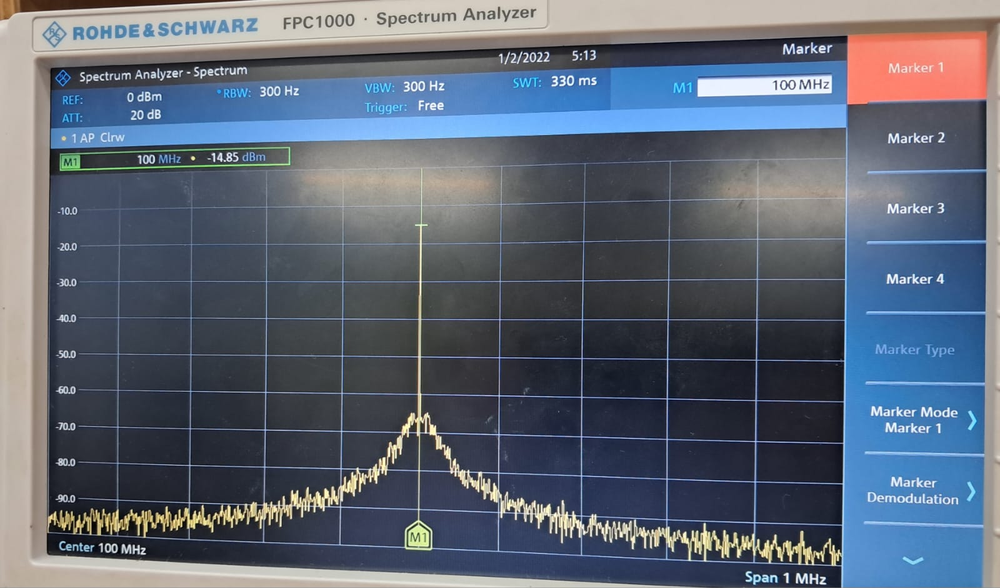

## Fase 1: Establecimiento de la Línea Base (Calibración)
Generación de la Señal de Prueba: Configure el generador para emitir una señal de prueba  a una frecuencia específica (ej. 100 MHz) y una potencia conocida (ej. -15 dBm).
Medición de Referencia: Conecte la salida del generador directamente a la entrada del analizador de espectro usando un cable de referencia corto y de alta calidad.
Registro de Potencia Inicial (P_in): Mida y registre la potencia exacta de la señal recibida en el analizador. Este es tu valor de potencia de entrada y será tu punto de comparación para todas las demás mediciones. Guarda una captura de pantalla.

**frecuencia:** 100MHz
**potencia conocida:** -14.85dBm

