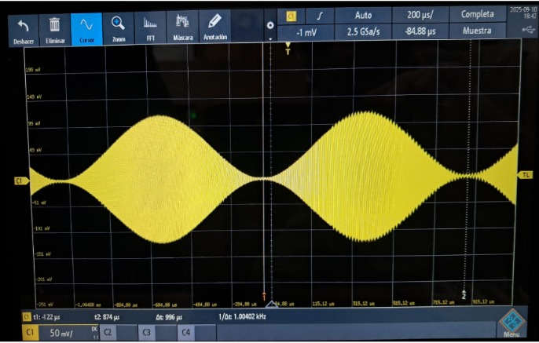
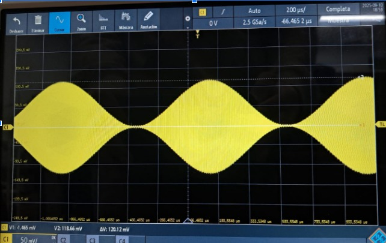
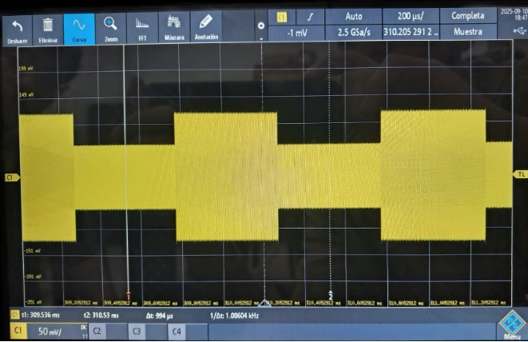
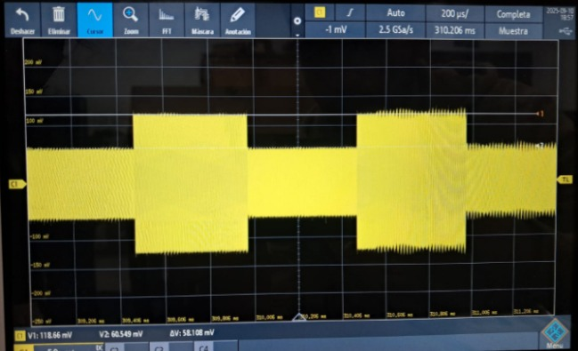
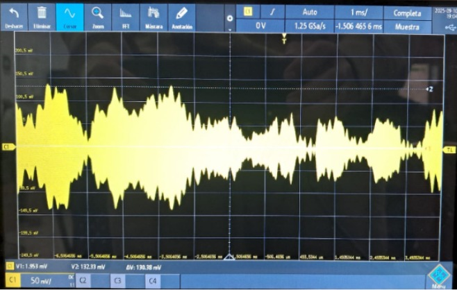

## Fase 2: Generación y Medición (Ejecución en Laboratorio)

1.  **Conexión Segura:** Conecte la salida de transmisión (TX1 / RX1) de su SDR al atenuador, y la salida del atenuador a la entrada del canal 1 del osciloscopio. Nota: recuerde que la amplitud maxima de la envolvente compleja debe ser menor a 0.5
2. **Modulación con Señales Periódicas:** 

   - Ejecute su diagrama de flujo de AM con la señal sinusoidal. Observe la forma de onda en el osciloscopio. Capture una imagen de la pantalla.

- Sin detener la transmisión, cambie la señal moduladora a la onda cuadrada. Observe cómo se modifica la envolvente. Capture una imagen.
3. **Modulación con Audio:** 

  - Seleccione el diagrama de flujo de AM. Utilice la fuente de audio (micrófono) y hable o reproduzca sonido. Observe cómo la amplitud de la portadora sigue la forma de onda de la voz.

## Solucion

### Señal senoidal 
en las siguientes imagenes de la señal sinusoidal, ubicamos los cursores de tal forma que encontraremos el periodo y la amplitud de la señal.

en esta imagen se puede observar el periodo de la onda senosoidal 
T=996u s

en esta imagen se puede observar la amplitud de la señal sinusoidal 
A=120.12mV

### Señal cuadrada

el periodo de la señal cuadrada es de T=994u s

la amplitud de la señal cuadrada es A=58.108mV

# señal sonido 
para la modulación con audio escogimos un audio del computador para mostrar la amplitud de la portadora y esta fue la imagen que tomamos:

 

