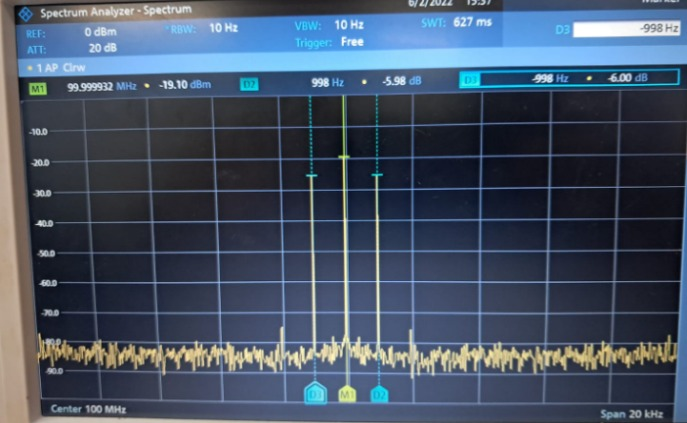
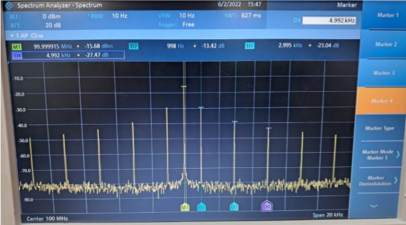
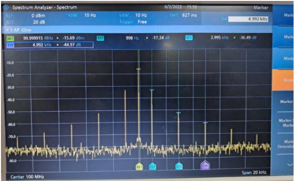
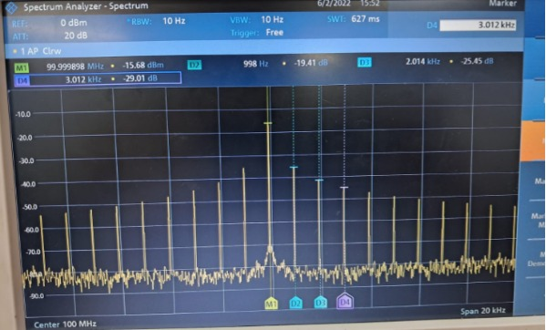
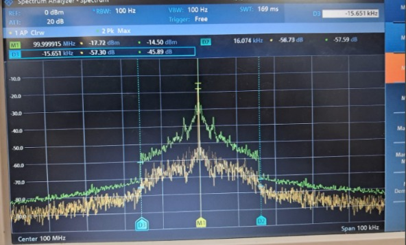

## Fase 3: Análisis de Espectro y Comparación

**Creación de la Tabla de Modulación:**  Consolide todas las capturas de pantalla en una tabla comparativa para cada tipo de señal moduladora en el analizador de espectro de la señal (seno, cuadrada, triangular, diente de sierra y audio).

**Análisis Comparativo:** Complete la tabla con las imágenes obtenidas y añada descripciones técnicas. La tabla debe permitir una comparación directa de:

- El efecto de una señal moduladora seno vs. moduladora onda cuadrada en el dominio de la frecuencia.

- El efecto de una señal moduladora seno vs. moduladora audio en el dominio de la frecuencia.

## señal moduladora seno

## señal moduladora cuadrada

## señal moduladora triangular

## señal moduladora diente de sierra

## señal moduladora de audio

