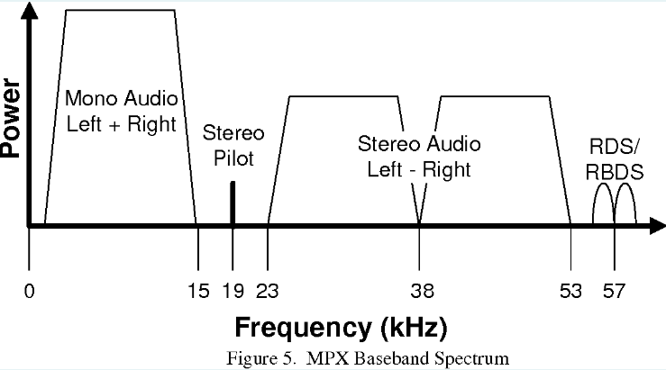

## FASE: DOS 
Esta es la fase crítica del procesamiento de la señal, donde se construye la estructura de la señal que modulará la portadora de RF.

Objetivo Específico 2.1: Cargar el archivo de audio estéreo en el entorno de desarrollo (GNU Radio).

Objetivo Específico 2.2: Implementar los bloques o el código necesario para generar los componentes de la señal MPX:

Crear la señal de suma (L+R) para compatibilidad monofónica.

Generar el tono piloto de 19 kHz, que es la referencia de fase para la demodulación estéreo.

Crear la señal de diferencia (L-R) y modularla en una subportadora de 38 kHz mediante AM de Doble Banda Lateral con Portadora Suprimida (AM-DSB-SC).

Objetivo Específico 2.3: Combinar (sumar) las tres señales anteriores para formar la señal MPX final.

Objetivo Específico 2.4: Analizar el espectro de la señal MPX resultante y verificar la correcta ubicación y amplitud relativa de cada uno de sus componentes.

